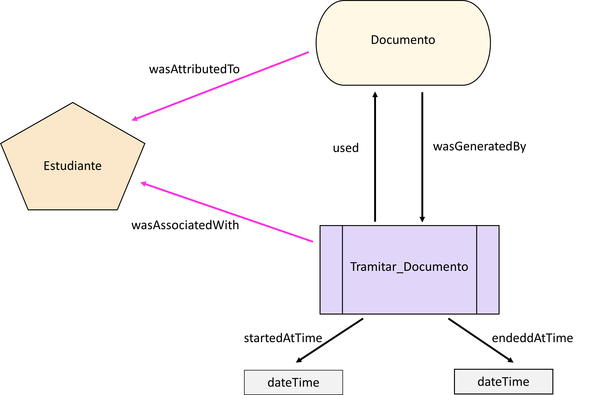
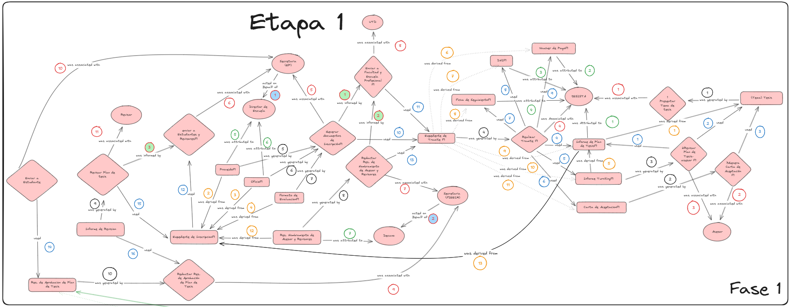
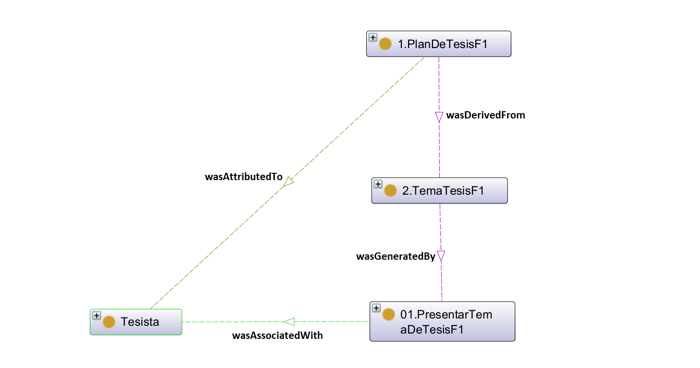
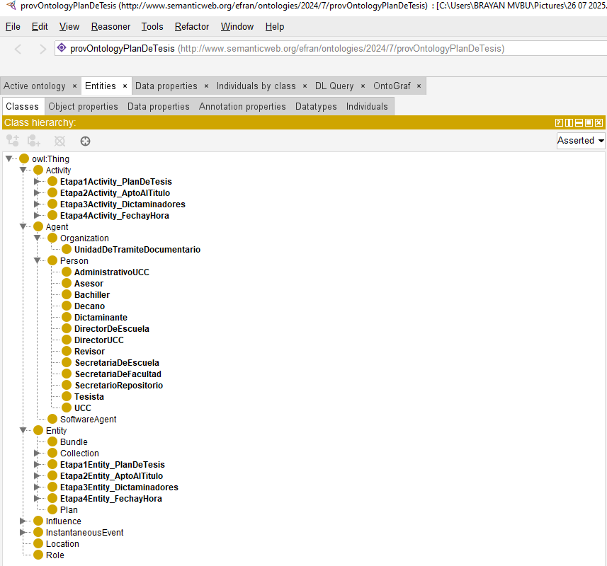

# 📌 MVP - Tesys UNSAAC

Este repositorio contiene el **Producto Mínimo Viable (MVP)** desarrollado como parte de la investigación *“Desarrollo de una ontología para la gestión de tesis en la Facultad de Ingeniería Eléctrica, Electrónica, Informática y Mecánica de la Universidad Nacional de San Antonio Abad del Cusco”*.  

---

## 🎯 Objetivo
La construcción del MVP tuvo como propósito **poner en práctica la ontología desarrollada en Protégé**, demostrando cómo un modelo conceptual, inicialmente abstracto, puede materializarse en un sistema web funcional.  

Este prototipo reproduce la etapa de **Presentación del Plan de Tesis** y está diseñado para ser utilizado por actores clave del proceso, como el secretario y el bachiller, evidenciando la aplicabilidad real de la ontología en un entorno académico.  

---

## 🧩 Diseño de la ontología con PROV-O
Se aplicaron los principios de PROV-O para representar el proceso de gestión de tesis, lo que permitió estructurar de forma precisa la relación entre agentes, entidades y actividades. A través de este enfoque, se logró comprender mejor cómo interactúan los diferentes elementos del proceso y cómo se vinculan las etapas entre sí.

PROV-O facilita modelar las relaciones de origen y responsabilidad entre los componentes del proceso de tesis. Por ejemplo la actividad denominada tramitar documento, la cual está asociada al agente estudiante, es decir, es el estudiante quien ejecuta esta acción. Esta actividad genera la entidad documento, que representa el producto o resultado de la acci´on realizada por el estudiante. Posteriormente, la actividad se lleva a cabo durante un tiempo específico, anotando cuándo comienza y cuándo termina. 



En el proceso de gestión de tesis se identificaron cuatro etapas. El MVP se centra en la primera etapa, que comprende el nombramiento del asesor y la inscripción del plan de tesis, pues constituye la fase inicial del proceso. En esta etapa, el estudiante formaliza su intención de desarrollar una tesis mediante la presentación de su plan de investigación y la designación de un asesor que lo acompañará en su desarrollo. Esta clasificación establece el punto de partida de la gestión de tesis, garantizando que el estudiante cuente con el respaldo y la orientación académica necesarios.  



En Protégé, los conceptos principales de PROV-O —actividades, entidades y agentes— se encuentran dentro del apartado de Clases. En términos ontológicos, una clase representa un conjunto de individuos que comparten propiedades comunes; es decir, modela un tipo de objeto o concepto que puede tener instancias. Así, las clases Activity, Entity y Agent definen la base estructural para representar los elementos del proceso de gestión de tesis.

 

 

---

## 🔎 Trazabilidad Ontología → MVP
El MVP asegura la trazabilidad de los datos, desde su definición en el modelo ontológico hasta su visualización en la interfaz web, garantizando **consistencia y seguimiento** en todo el proceso. 

 

---

## 🛠️ Herramientas utilizadas
- Protégé  
- PostgreSQL  
- Python  
- FastAPI  
- Svelte  

---

## ▶️ Ejecución

### 🗄️ PostgreSQL
```sql
CREATE DATABASE tesys;
CREATE TABLE …;
SELECT * FROM general.proyectos;
SELECT * FROM general.colaboraciones;
SELECT * FROM general.usuarios;
```

### ⚙️ Back-End (API con FastAPI y Python)
```bash
python -m venv env
.\env\Scripts\activate
pip install -r .\requirements.txt
fastapi dev .\main.py
```

### ⚙️ Front-End (Interfaz con Svelte)
```bash
npm install
npm run dev
```
---


## ✍️ Elaborado por
- Frank Elizon Carcausto Mamani  
- Brayan Umiyauri Ilachoque  
- Vanessa Mendoza Inoñan  


